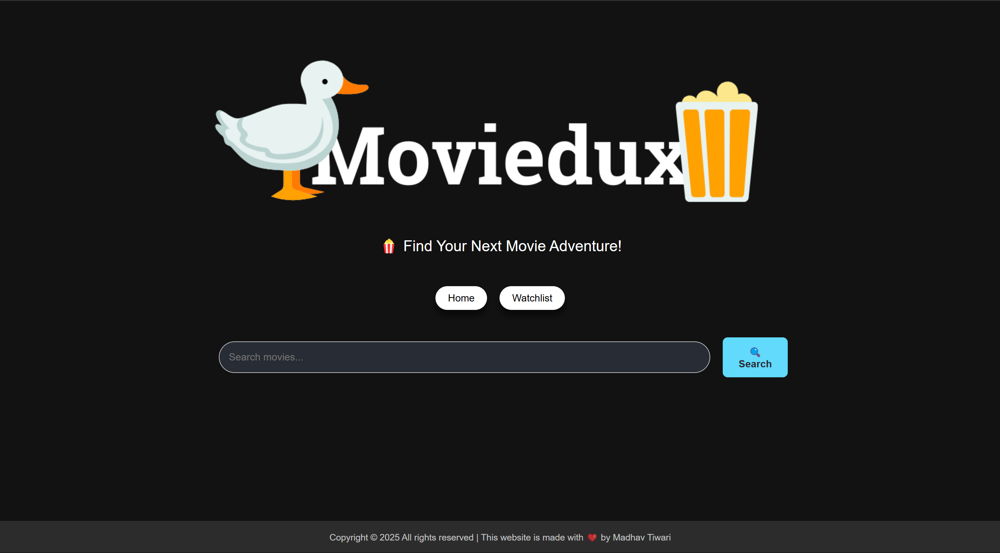

# 🎬 MovieDux - React.js Movie Watchlist App

**MovieDux** is a sleek and interactive movie watchlist app built using **React.js**. It allows users to search for movies, filter by genre/rating, and maintain a personalized watchlist. This project was a key part of my React learning journey, helping me strengthen my skills in state management, API integration, and UI enhancements.

## 🚀 Features

✅ **Search movies** using the OMDb API 🎥 
✅ **Filter movies** by genre and rating 🎭⭐  
✅ **Add/remove movies** from your watchlist 📝 
✅ **Persistent state** for seamless user experience 🔄  
✅ **Smooth UI updates** with loaders and transitions 💡  
✅ **React Router** for easy navigation 🛤️  

## 🛠️ Tech Stack

- **React.js** (Hooks, Router, State Management)
- **OMDb API** (Real-time movie data)
- **CSS & Styled Components** (Enhanced UI/UX)

## 📸 Preview  

🔹 *Click on the image below to watch the video guide!*  

<a href="https://drive.google.com/file/d/1lKOBEfl6_0DAMOu4LF7_t8PokR_9z7cw/view?usp=sharing" target="_blank">  
    
</a>  

## 🚀 Installation & Setup

1. **Clone the repo**
   ```sh
   git clone https://github.com/ermadhav/MovieDux.git
   cd MovieDux
   ```

2. **Install dependencies**
   ```sh
   npm install
   ```

3. **Run the app**
   ```sh
   npm start
   ```

## 🔗 Live Demo
[Click here to try it out!](https://moviedux-six.vercel.app/)

## 🤝 Contributing
Have ideas to improve MovieDux? Feel free to fork, submit issues, or create pull requests!

## 📩 Connect With Me
🔗 **LinkedIn:** https://www.linkedin.com/in/ermadhav/  
🐦 **Twitter/X:** https://x.com/MadhavT50928649  
📧 **Email:** contact.madhavtiwari@gmail.com

---

**⭐ If you like this project, give it a star on GitHub! ⭐**
